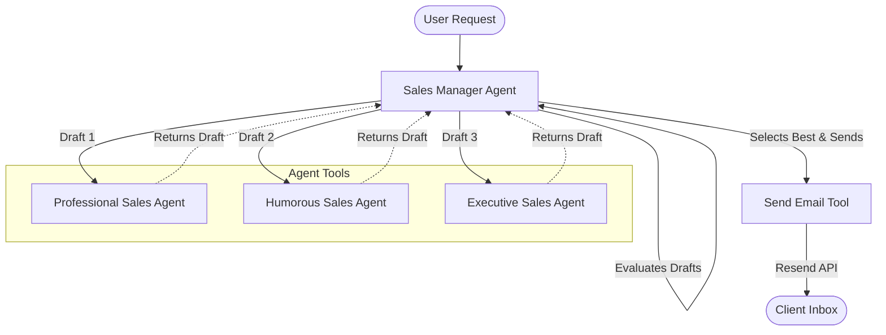

# ComplAI Sales Orchestrator


https://github.com/user-attachments/assets/338fd9d9-06a4-4215-8161-1f191e36dadd


This project is an AI-powered sales email generator for **ComplAI**, a SaaS tool that simplifies SOC2 compliance and audit preparation. 

Instead of a single AI generating an email, this project uses an **Agent Orchestration** pattern (via `openai-agents`) where multiple AI "Sales Agents" with different personalities write distinct drafts. A "Sales Manager" AI then evaluates the drafts, selects the best one, and automatically sends it to the target via the Resend API.

The backend is built with **FastAPI** and uses Server-Sent Events (SSE) to stream the orchestration process back to a client in real-time.

## The Agent Framework

This project leverages the official `openai-agents` Python SDK to create and orchestrate the agents. We define each sales persona as an individual `Agent`, and then expose them as *tools* to a primary `Sales Manager` agent.

Here is a snippet showing how we assemble the agents programmatically:

```python
from agents import Agent

# Define the sub-agents with distinct system instructions
sales_agent1 = Agent(name="Professional Sales Agent", instructions=instructions1, model="gpt-5.4-mini")
sales_agent2 = Agent(name="Humorous Sales Agent", instructions=instructions2, model="gpt-5.4-mini")
sales_agent3 = Agent(name="Executive Sales Agent", instructions=instructions3, model="gpt-5.4-mini")

# Expose the sub-agents as callable tools
tool1 = sales_agent1.as_tool(tool_name="sales_email_writer_1", tool_description=description)
tool2 = sales_agent2.as_tool(tool_name="sales_email_writer_2", tool_description=description)
tool3 = sales_agent3.as_tool(tool_name="sales_email_writer_3", tool_description=description)

# Provide the sub-agents (and a standard email sending tool) to the Manager
tools = [tool1, tool2, tool3, send_email_tool]

# The Manager Agent is responsible for executing the workflow
sales_manager = Agent(
    name="Sales Manager", 
    instructions=manager_instructions, 
    tools=tools, 
    model="gpt-5.4-mini"
)
```

## How it Works (Agent Orchestration)

When a request comes in (e.g., "Write a cold sales email to a startup CEO"), the system triggers the **Sales Manager Agent**. The Manager acts as the orchestrator and has access to several tools. 



### 1. Generation Phase
The Sales Manager invokes three different sub-agents (exposed as tools) to generate three distinct drafts:
- **Professional Agent**: Writes with gravitas, seriousness, and credibility.
- **Humorous Agent**: Writes in a witty, engaging, and funny style.
- **Executive Agent**: Writes highly concise, to-the-point emails.

### 2. Evaluation Phase
Once all three drafts are generated, the Manager Agent reviews them based on the provided user context and evaluates which one is the most effective. 

### 3. Execution Phase
After selecting the winning draft, the Manager Agent invokes the `send_email_tool`, which dynamically generates the email subject and sends the plain text & HTML bodies via the **Resend API**.

## Getting Started

1. Set up a virtual environment and install dependencies:
   ```bash
   python3 -m venv venv
   source venv/bin/activate
   pip install -r backend/requirements.txt
   ```
2. Create a `.env` file in the `backend/` directory with your API keys:
   ```env
   RESEND_API_KEY=your_resend_api_key
   OPENAI_API_KEY=your_openai_api_key
   FROM_EMAIL_ADDRESS=LogSense <no-reply@devorbit.live>
   TO_EMAIL_ADDRESS=target@example.com
   ```
3. Run the backend server:
   ```bash
   cd backend
   uvicorn main:app --reload
   ```

---

<p align="center">
  Built by <a href="https://profile-64ef8.firebaseapp.com/">Ramveer Singh</a> · 
  <a href="https://www.linkedin.com/in/ramveer7up/">LinkedIn</a> · 
  <a href="https://github.com/ramveer93">GitHub</a>
</p>
